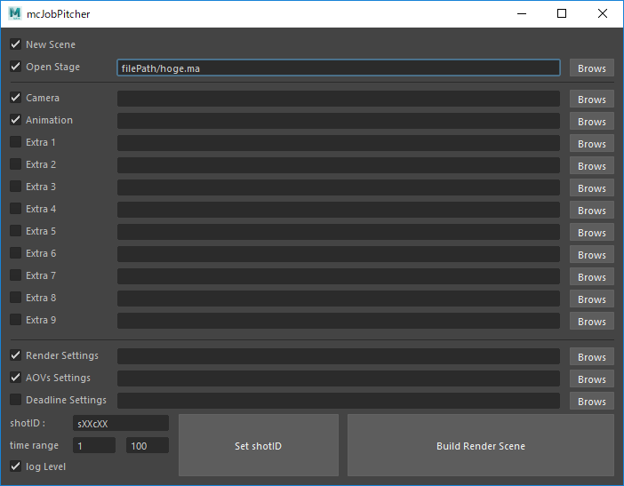

# msJobPitcher
MS用のレンダーシーン構築＆レンダージョブのサブミットツールです。

起動コマンド
```python
import msJobPitcher
msJobPitcher.execution()
```
パスが通ってない場合はこれで通してください。
```python
import sys 
sys.path.append( 'filePath\msJobPitcher' )
```

# config.json
プロジェクトパスなどのデフォルトパスを記述します。不要なものは空白で構いません。

# 機能
チェックボックスを付けたジョブが上から順に実行されます。


### New Scene
強制的に新規シーンを開きます。

### Open Stage
ベースとなる背景シーンを開きます。これはファイルオープンです。デフォルトのファイルを `config.json` で指定できます。

### Camera & Animation
データをファイルインポートします。(.ma .mb .obj .fbx)

ネームスペースなどは付きません。shotIDを元にカメラ・アニメーションデータを自動的に指定します。

### Extra
その他のデータをファイルインポートします。(.ma .mb .obj .fbx)

ネームスペースなどは付きません。 

### Render Settings & AOVsSetting
`config.json` で指定したデフォルトの設定ファイルをインポートします。

### Deadline Setting(開発中)
`config.json` で指定したデフォルトの設定ファイルをインポートし、レンダージョブをDeadline10に送信します。

この機能を利用するには事前にDeadline10のセットアップを済ませる必要があります。

また、プロジェクトパスをDeadline10が読み書き可能なネットワークドライブにする必要があります。

### time renge(開発中)
カットのタイムレンジを指定します。ここで設定したレンジがレンダージョブに設定されます。

### shotID
カット事の固有IDを設定します。プロジェクトの命名規則に従ってください。

標準では `shotID.shot.v1.ma` のアニメーションデータと `shotID.cam.v1.fbx` のカメラデータを参照するよう自動的にファイルパスをセットします。

### save Scene(開発中)
ビルドしたシーンをプロジェクトパスのscenes直下に `shotID.render.vX.ma` として保存します。

# myLogger
logを仕込むときは `import logging` したうえで
デバッグ時のみの表示は `logging.debug('hoge')`
実行時に常に表示は `logging.info('hoge')`

uiの左下にあるチェックボックスでトグルできます。（現在のデフォルトはデバッグモード）
