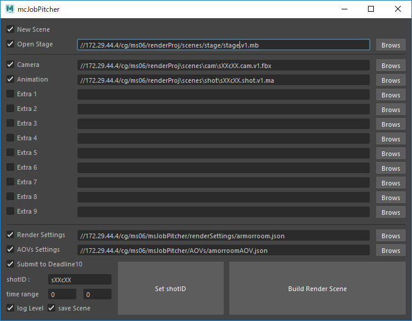

# msJobPitcher
MS用のレンダーシーン構築＆レンダージョブのサブミットツールです。

[リリース記事：レンダーシーンを構築するツール「msJobPitcher」をリリースしました。](https://qiita.com/paty-6991/items/3c779d21264e9f2ae65f)

起動コマンド
```python
import msJobPitcher
msJobPitcher.execution()
```
パスが通ってない場合はこれで通してください。
```python
import sys 
sys.path.append( 'filePath\msJobPitcher' )
```

# config.json
プロジェクトパスなどのデフォルトパスを記述します。不要なものは空白で構いません。

# 機能
チェックボックスを付けたジョブが上から順に実行されます。


### New Scene
強制的に新規シーンを開きます。

### Open Stage
ベースとなる背景シーンを開きます。これはファイルオープンです。デフォルトのファイルを `config.json` で指定できます。

### Camera & Animation
データをファイルインポートします。(.ma .mb .obj .fbx)

ネームスペースなどは付きません。shotIDを元にカメラ・アニメーションデータを自動的に指定します。

### Extra
その他のデータをファイルインポートします。(.ma .mb .obj .fbx)

ネームスペースなどは付きません。 

### Render Settings & AOVsSetting
`config.json` で指定したデフォルトの設定ファイルをインポートします。

### Submit to Deadline10
レンダージョブをDeadline10に送信します。レンダリングカメラはshotIDのカメラのみがrenderbleに設定されます。

この機能を利用するには事前にDeadline10のセットアップを済ませる必要があります。

また、プロジェクトパスをDeadline10が読み書き可能なネットワークドライブにする必要があります。

現在は下記項目を設定します。
- Department --> ms06
- Group --> normal_node
- Priority --> 50

また下記項目はレンダー設定を引き継ぎます。
- Job Name
- Frame List
- Project Path
- Output Path

### time renge
カットのタイムレンジを指定します。ここで設定したレンジがレンダージョブに設定されます。

timecode.csvにshotIDごとのタイムレンジが存在する場合はそちらをset shotID時に代入します。

### shotID
カット事の固有IDを設定します。プロジェクトの命名規則に従ってください。

標準では `shotID.shot.vX.ma` のアニメーションデータと `shotID.cam.vX.fbx` のカメラデータを参照するよう自動的にファイルパスをセットします。

### save Scene
ビルドしたシーンをプロジェクトパスのscenes直下に `shotID.render.vX.ma` として保存します。

# myLogger
logを仕込むときは `import logging` したうえで
デバッグ時のみの表示は `logging.debug('hoge')`
実行時に常に表示は `logging.info('hoge')`

uiの左下にあるチェックボックスでトグルできます。（現在のデフォルトはデバッグモード）
